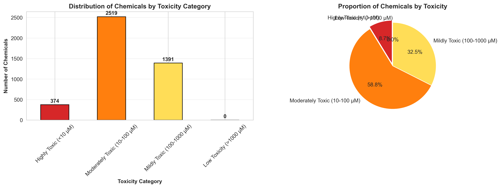
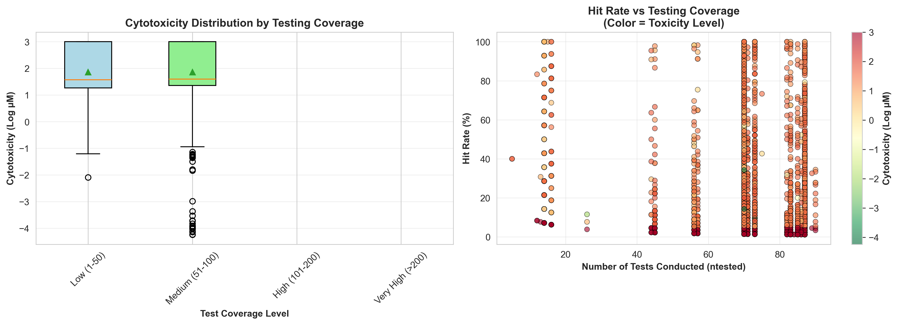
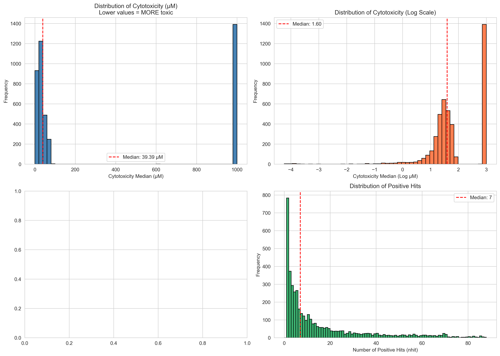
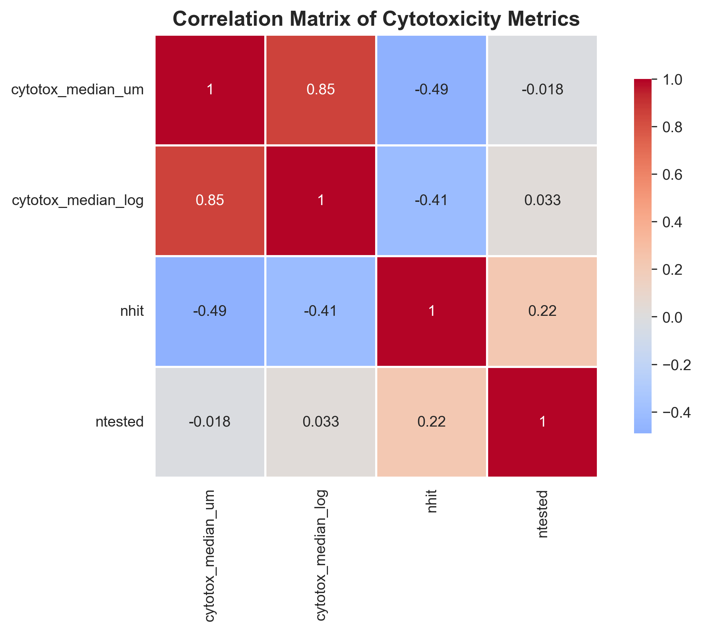
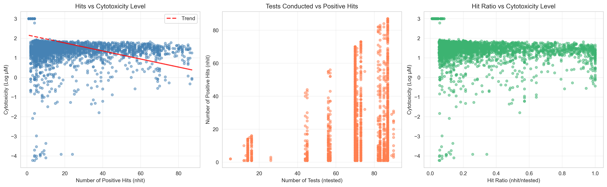

# Cytotoxicity Analysis - In VitroDB v4.3 (AUG 2024)

## Overview

This project analyzes cytotoxicity screening data from the **In VitroDB v4.3 database (August 2024)**, containing over 10,000 chemical compounds tested for in-vitro cytotoxic effects. The analysis aims to identify patterns in chemical toxicity and communicate findings in a clear, accessible way for both technical and non-expert audiences.

## Dataset

- **Source**: In VitroDB v4.3 (AUG 2024)
- **Size**: 10,487 chemical compounds
- **Format**: Excel (.xlsx)
- **Key Metrics**:
  - `cytotox_median_um`: Median cytotoxicity concentration in micromolar (µM) - **lower values indicate MORE toxicity**
  - `nhit`: Number of positive hits (measurable toxic effects)
  - `ntested`: Number of assays conducted
  - Various bounds and log-transformed values
- **Data Quality**: 100% complete in key columns (chnm, cytotox_median_um, nhit, ntested)

## Project Structure

```
axeleres-assignment/
├── cytotoxicity_analysis.ipynb          # Main analysis notebook (Tasks 1-4)
├── cytotox_invitrodb_v4_3_AUG2024.xlsx # Raw dataset
├── requirements.txt                     # Python dependencies
├── README.md                            # This file
├── .gitignore                           # Git configuration
└── Visualizations (6 PNG files):
    ├── distribution_analysis.png
    ├── correlation_matrix.png
    ├── relationship_analysis.png
    ├── toxicity_categories.png
    ├── top_20_toxic_chemicals.png
    └── testing_coverage_analysis.png
```

## Approach

### 1. Data Familiarization & Quality Check
- Loaded and examined dataset structure
- Identified key columns and their meanings
- Checked for missing values, duplicates, and outliers
- Calculated basic statistics: unique chemicals, testing coverage, hit rates

### 2. Trend Exploration
- Analyzed distributions of cytotoxicity metrics (both linear and log scales)
- Identified top 10 most toxic (lowest µM) and least toxic (highest µM) chemicals
- Explored relationships between:
  - Number of tests vs number of hits
  - Hit ratio vs cytotoxicity levels
  - Testing coverage vs reliability of measurements

### 3. Visualization & Communication
Created three main visualizations with detailed captions:
- **Distribution by Toxicity Categories**: Classified chemicals into 4 toxicity levels
- **Top 20 Most Toxic Chemicals**: Ranked by potency (lowest µM values)
- **Testing Coverage Analysis**: Relationship between testing thoroughness and reliability

### 4. Summary & Reflection
Synthesized key findings and highlighted surprising observations about:
- Chemical toxicity patterns
- Testing reliability
- Real-world implications for safety assessment

## Key Findings

### Chemical Toxicity Distribution
- **4,284 chemicals (40.9%)** showed measurable cytotoxic effects; **6,203 (59.1%)** showed no hits
- Among toxic chemicals: **58.8% moderately toxic** (10-100 µM), **8.7% highly toxic** (<10 µM), **32.5% mildly toxic** (100-1000 µM)
- Toxicity values span **10-million-fold range** (0.0001 µM to 1000 µM) - an enormous difference
- Distribution is **right-skewed**: Median 39.39 µM, Mean 345.20 µM

### Testing Insights & Data Validation
- **No testing bias detected**: Correlation between testing coverage and toxicity (r=0.033) is essentially zero
- More hits correlate with higher potency: **r=-0.414** (moderate negative) - chemicals with consistent toxic effects across assays are more potent
- This validates the screening approach is objective and unbiased

### Most Toxic Chemicals
- **Most toxic**: Enalapril acid (0.0001 µM); **Least toxic**: Acetamide (1000 µM)
- Top 20 most cytotoxic compounds require very low concentrations (<0.01 µM)
- Many cluster at detection limit (0.0001 µM), suggesting actual toxicity may be even lower

## Visualizations

### 1. Toxicity Categories (Main Visual)


**Insight**: Distribution shows 58.8% of toxic chemicals (2,519) fall in the moderately toxic range (10-100 µM), 8.7% (374) are highly toxic (<10 µM), and 32.5% (1,391) are mildly toxic (100-1000 µM). This indicates most chemicals showing toxicity are moderately dangerous rather than extremely hazardous.

### 2. Top 20 Most Toxic Chemicals (Main Visual)


**Insight**: The top 20 most toxic chemicals range from 0.0001 to 0.0082 µM. Many cluster at the detection limit (0.0001 µM), including Enalapril acid, suggesting these chemicals may be even more toxic than measurable. These require priority regulatory attention.

### 3. Testing Coverage and Reliability (Main Visual)


**Insight**: Box plot and scatter analysis show no systematic relationship between testing frequency and toxicity levels. Median toxicity remains consistent across different testing coverage levels, validating that the screening approach is unbiased and reliable.

### Supporting Visualizations

#### Distribution Analysis

Four-panel overview showing: histogram (right-skewed), log-transformed histogram, box plot with outliers, and Q-Q plot confirming non-normal distribution.

#### Correlation Matrix

Heatmap showing relationships between variables. Key finding: ntested vs toxicity (r=0.033) shows no bias; nhit vs toxicity (r=-0.414) shows consistent hits correlate with higher potency.

#### Relationship Analysis

Three scatter plots exploring: ntested vs nhit (r=+0.225), nhit vs toxicity (r=-0.414), and ntested vs toxicity (r=+0.033).

## How to Run the Analysis

### Prerequisites
Ensure you have Python 3.7+ installed with the following libraries:
```bash
pip install pandas numpy matplotlib seaborn scipy openpyxl jupyter
```

### Running the Notebook
1. Clone or download this repository
2. Ensure the dataset file `cytotox_invitrodb_v4_3_AUG2024.xlsx` is in the same directory
3. Launch Jupyter Notebook:
   ```bash
   jupyter notebook cytotoxicity_analysis.ipynb
   ```
4. Run all cells sequentially (Cell → Run All)

### Expected Output
- Statistical summaries printed to console
- 6 visualization plots saved as PNG files
- Complete analysis with interpretations in the notebook
- All findings matching the README documented insights

## Dependencies

```
pandas >= 1.3.0
numpy >= 1.21.0
matplotlib >= 3.4.0
seaborn >= 0.11.0
scipy >= 1.7.0
openpyxl >= 3.0.0  # For reading Excel files
jupyter >= 1.0.0
```

## Interpretation Guide

### Understanding Cytotoxicity Values
- **Lower µM = MORE toxic**: A chemical with 1 µM is more toxic than one with 100 µM
- **Highly Toxic**: < 10 µM
- **Moderately Toxic**: 10-100 µM
- **Mildly Toxic**: 100-1000 µM
- **Low Toxicity**: > 1000 µM

### Understanding Testing Metrics
- **nhit**: Number of positive results - higher indicates more consistent toxicity
- **ntested**: Total tests conducted - higher indicates more thorough evaluation
- **hit_ratio**: Consistency of toxic effects (nhit/ntested)

## Key Takeaways for Discussion

1. **Data Quality**: 100% completeness in key columns (chnm, cytotox_median_um, nhit, ntested). Zero duplicates. High-quality, reliable dataset for analysis.

2. **Toxicity Patterns**: 40.9% of chemicals show measurable toxicity. Among these, 58.8% are moderately toxic (10-100 µM), not extremely dangerous. Toxicity spans 10-million-fold range (0.0001-1000 µM).

3. **No Testing Bias**: Critical validation - testing coverage does NOT correlate with toxicity (r=0.033). More testing doesn't artificially inflate or deflate results. Data is objective.

4. **Surprising Correlation**: Chemicals with consistent toxic effects (high nhit) are also more potent (r=-0.414). Broadly acting toxins are more dangerous - an important biological insight.

5. **Risk Prioritization**: 374 highly toxic chemicals (<10 µM) identified, with many at detection limit (0.0001 µM). These require priority regulatory attention and may be even more toxic than measurable.

6. **59% No Measurable Toxicity**: Over half of chemicals show no hits. This indicates either true safety or toxicity beyond 1000 µM testing range - important for understanding screening limitations.

## Questions for Follow-up Discussion

- **59% No Hits**: Should we investigate whether these chemicals are truly safe or just toxic beyond 1000 µM? How can we prioritize follow-up testing?

- **Detection Limit Clustering**: Many highly toxic chemicals cluster at 0.0001 µM. How should we assess actual toxicity when it exceeds measurement capability?

- **Regulatory Priorities**: Given 374 highly toxic chemicals vs 2,519 moderately toxic, how should regulatory resources be allocated?

- **Correlation Insight**: The finding that consistent toxicity (high nhit) correlates with potency (r=-0.414) - does this suggest broadly acting chemicals need different assessment criteria?

- **Chemical Structure**: Can we incorporate molecular structure data to identify features predicting high toxicity?

## Author Notes

This analysis balances technical rigor with accessibility, aiming to make complex toxicology data understandable without sacrificing accuracy. The visualizations and narrative structure are designed for presentation to diverse audiences, from regulatory experts to general stakeholders.

---

**Analysis Date**: October 2024
**Dataset Version**: In VitroDB v4.3 (AUG 2024)
**Tool**: Jupyter Notebook with Python 3
